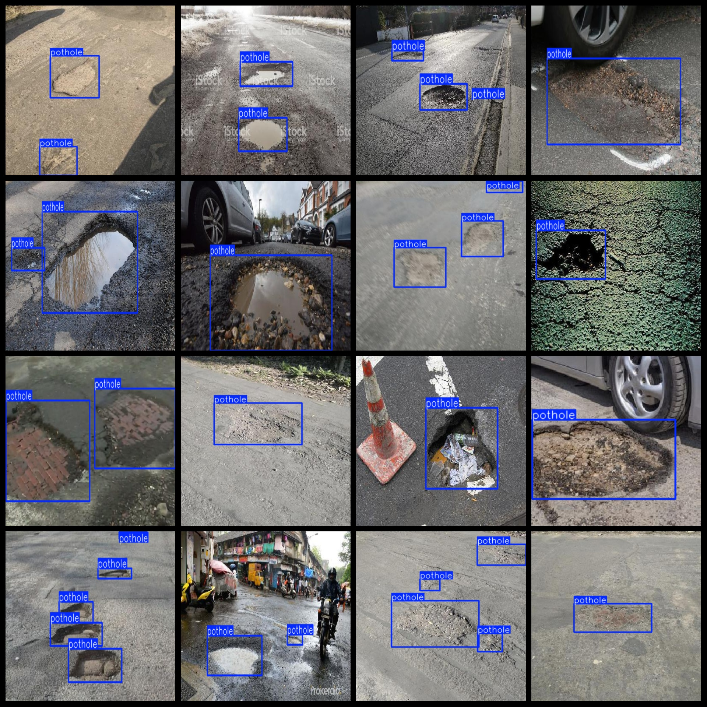
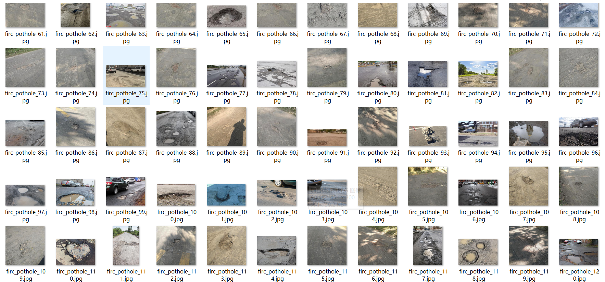

# [YOLO Dataset] Road Surface Pothole Dataset YOLO-VOC 664 images

Dataset introduction: The main focus of the images are on the detection of potholes on rural cement road surfaces, with very few detections on asphalt road surfaces in the country roads. There are no repeated enhancements in this dataset.

Dataset Format: VOC format + YOLO format

The compressed file contains: three folders, each storing images, xml files, and text files.

The total number of jpg images in the JPEGImages folder is 664.

The total number of XML files in the Annotations folder is 664.

The total number of txt files in the labels folder is: 664.

Number of tag types: 1

Tag Name: ["pothole"]

Number of boxes per label:

Pothole frames = 1737

Total Frames: 1737

Image clarity (Resolution: pixel): Clear, pixel 300-720, size mostly in the range of dozens to over 100KB.

Is the image enhanced: No

Shape of the label: Rectangular box, used for object detection and recognition.

Important Note: None

## Images

---

Here is a pay link on Stripe (https://buy.stripe.com/3cs8yP7sY87d0vu9AB). Please contact me lonlonago@foxmail.com after funding $89, and I will send you a complete data files, thank you!

